The ionomics of lettuce infected by *Xanthomonas campestris* pv. *vitians*
================

This notebook contains the necessary computations for the statistics of the paper *The ionomics of lettuce infected by *Xanthomonas campestris\* pv. *vitians*.

Load libraries
==============

Some packages need to be loaded to perform the full analysis.

``` r
library("tidyverse")
library("cowplot")
library("ggrepel")
library("grid")
library("nlme") # to compute experimental random effects
library("ade4") # linear discriminant analysis
library("vegan") # redundancy analysis
library("mvoutlier") # remove outliers, sign2 function
library("compositions") # ilr
library("ellipse") # ellipses in plots
library("plyr")
```

Other functions are placed in the `lib` folder.

``` r
source("lib/plotDA_1.4.R") # plot LDA needs packages ggplot2, grid, ellipse and plyr
source("lib/ilrDefinition_1.2.R") # define balances
source("lib/codadend2.R") # coda dendrogram with extra features
```

Load and prepare data
=====================

The main data set is placed in file `data.csv`. The data set `sensib.csv` is a table relating cultivars and their degree of susceptibility to *Xanthomonas campestris* infection.

``` r
data <- read.csv(file = "data/data.csv", sep = ";", dec = ".")
susceptibility <- read.csv("data/sensib.csv", sep = ";")
```

Susceptibility factors must be ordered.

``` r
susceptibility$Niv..de.sens. <- factor(susceptibility$Niv..de.sens.,
                                    levels = c("Susceptible",
                                               "Intermediate",
                                               "Tolerant"), 
                                    ordered = TRUE)
```

Experiments are indeed factors, not numeric. Treatments (the `Trait` column) are renamed.

``` r
data$Experience <- factor(data$Experience)
data$Trait <- factor(ifelse(data$Trait == "inoc", "Infected", "Uninfected"))
```

Nitrogen is absent from `data.csv`. We can add it from the ionomic data set.

``` r
data_N <- read.csv(file = "data/analyse_chimique_laitue_all.csv", sep = ";", dec = ",", 
                   encoding = "UTF-8")
data_N$Trait <- factor(ifelse(data_N$Trait == "inoc", "Infected", "Uninfected"))
colnames(data_N)[1] <- "Cultivars"

data$N <- NA
for (i in 1:nrow(data_N)) {
  cultivar_i <- data_N$Cultivars[i]
  trait_i <- data_N$Trait[i]
  N_i <- data_N$N[i]
  data$N[data$Cultivars == cultivar_i & data$Trait == trait_i] <- N_i
}
if (mean(data$N) < 1000) data$N <- data$N * 1000
```

Compositional data transformations
==================================

The `parts` matrix contains the elements of the simplex. I'm adding `Fv`, the filling value (elements other than those measured in the ionome, mainly C, O and H). The `acomp` function closes all lines to a constant sum of 1.

``` r
parts <- data[, -c(1, 2, 3, 4, 15)]
parts$Fv <- 1e+06 - rowSums(parts)
comp <- acomp(parts)
```

Balances are computed according to a schema encoded in a sequential binary partition (SBP). The names of the balances are defined in `ilrDef` as `[list of denominator components | list numerator components]`.

``` r
sbp <- read.csv(file = "data/sbp_sansAl.csv", sep = ";", dec = ".", header = TRUE)
ilrDef <- ilrDefinition(sbp = sbp, side = "-+")  # balance definitions from sbp
ilrDef[1] <- "[Fv | nutrients]"
ilrDef[2] <- "[oligo | macro]"
ilrNo <- paste0("ilr", 1:nrow(sbp))  # ilr number (shorter column name if needed)
bal <- ilr(comp, V = gsi.buildilrBase(t(sbp)))  # calculer les balances
colnames(bal) <- ilrDef
CoDaDendrogram(comp, V = gsi.buildilrBase(t(sbp)))
```

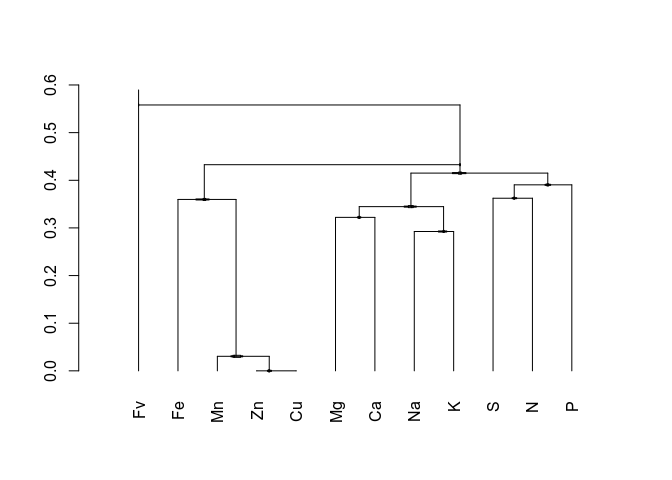

The following chunk creates a coda dendrorgam figure showing how balances are created in the sbp.

``` r
comp_dummy <- matrix(1L, nrow = 5, ncol = ncol(comp))
colnames(comp_dummy) <- colnames(comp)
png("images/codadend_schema.png", width = 1500, height = 1000, res = 300)
par(mar = c(3, 0, 0, 0))
CoDaDendrogram2(comp_dummy, V = gsi.buildilrBase(t(sbp)), show.range = F, equal.height = TRUE)
dev.off()
```

    ## png 
    ##   2

Data exploration
================

A vector color blind - friendly colors, as suggested by [colorbrewer2.org](http://colorbrewer2.org/#type=diverging&scheme=PuOr&n=3) for each experiment.

``` r
couleurs <- as.character(factor(data$Experience, levels = c(1, 2, 3), 
                                labels = c(rgb(241/255, 163/255, 64/255, 0.7),
                                           rgb(247/255, 247/255, 247/255, 0.7),
                                           rgb(153/255, 142/255, 195/255, 0.7))))
```

A pairs plot can be used to explore experimental effects.

``` r
pairs(bal, bg = couleurs, pch = 21, cex = 1, upper.panel = NULL)
par(xpd = TRUE)
legend(0.8, 0.8, legend = c("Experiment 1", "Experiment 2", "Experiment 3"), fill = unique(couleurs))
```

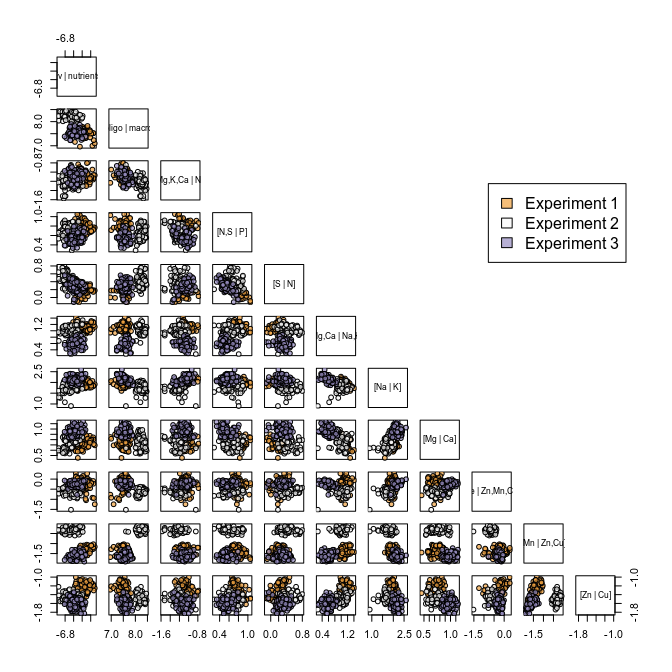

There is a clear random experimental effect. The \[Mn | Zn,Cu\] balance is clearly discriminant. A linear discriminant analysis could be used for a more condensed appreciation.

``` r
group <- data$Experience
meta_group <- data$Trait
pca <- dudi.pca(unclass(bal), scannf = FALSE, scale = FALSE) # ilrs are already scaled in the Aitchison geometry
lda <- discrimin(pca, group, scannf = FALSE)
```

The densities also show this effect.

``` r
ggdf <- data.frame(data[, c(1, 3, 15)], bal)
colnames(ggdf)[grepl("X.", colnames(ggdf))] <- ilrDef
ggdf <- ggdf %>%
  gather(variable, balance, -Cultivars, -Trait, -Experience)
ggdf %>%
  ggplot(aes(x = balance)) + 
  facet_grid(Trait ~ variable, scales = "free") + 
  geom_density(aes(fill = Experience)) +
  scale_fill_manual(values = unique(couleurs)) + 
  xlab("Balance") +
  ylab("Density") +
  theme_bw()
```

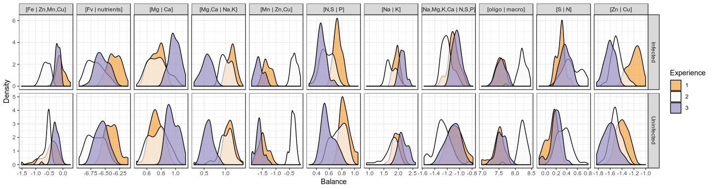

The `plotDA` custom function is used for publishable-ready plots.

``` r
plotDA(discrimin = lda, fac = group, groupfac = NULL, scaling = 2, propLoadings = 0.8, 
       facname = "Experiment", groupfacname = "Group") + scale_fill_manual(values = unique(couleurs)) + 
  theme_bw()
```

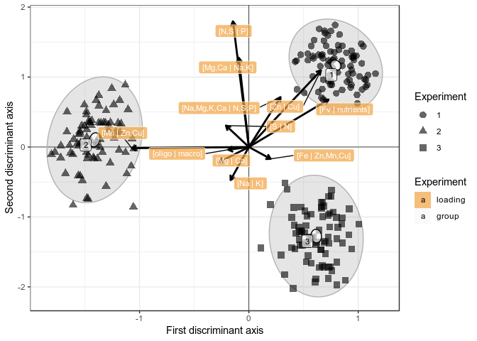

``` r
ggsave(filename = "images/LDA-Experience.png", width = 7, height = 7, dpi = 300)
```

Remove the experimental effect
==============================

In order to remove the experimental effect, I compute a mixed model for each ilr as response and, as features, the interacting cultivar and treatment as fixed effects and the experiment as random effect.

``` r
mmdf <- data.frame(data[, c(1, 3, 15)], bal)  # mmdf: mixed-model dataframe
colnames(mmdf)[4:14] <- ilrNo
mm_detrend <- list()
for (i in ilrNo) {
  fixed_formula <- as.formula(paste0(i, " ~ Cultivars * Trait"))
  mm_detrend[[i]] <- lme(mmdf, fixed = fixed_formula, random = ~1 | Experience)
}
```

For sake of data exploration, I compute an anova to test if cultivars and treatment has an effect on ilrs.

``` r
for (i in seq_along(mm_detrend)) {
  print(ilrDef[i])
  print(anova(mm_detrend[[i]], type = "marginal"))
}
```

    ## [1] "[Fv | nutrients]"
    ##                 numDF denDF  F-value p-value
    ## (Intercept)         1   218 4791.510  <.0001
    ## Cultivars           9   218   23.521  <.0001
    ## Trait               1   218    0.008  0.9275
    ## Cultivars:Trait     9   218    1.337  0.2189
    ## [1] "[oligo | macro]"
    ##                 numDF denDF   F-value p-value
    ## (Intercept)         1   218 1130.5255  <.0001
    ## Cultivars           9   218    4.4178  <.0001
    ## Trait               1   218    0.1922  0.6615
    ## Cultivars:Trait     9   218    2.5204  0.0091
    ## [1] "[Na,Mg,K,Ca | N,S,P]"
    ##                 numDF denDF  F-value p-value
    ## (Intercept)         1   218 375.4241  <.0001
    ## Cultivars           9   218   7.0507  <.0001
    ## Trait               1   218   5.3997  0.0211
    ## Cultivars:Trait     9   218   5.7512  <.0001
    ## [1] "[N,S | P]"
    ##                 numDF denDF  F-value p-value
    ## (Intercept)         1   218 52.77706  <.0001
    ## Cultivars           9   218 10.83241  <.0001
    ## Trait               1   218  1.69148  0.1948
    ## Cultivars:Trait     9   218  8.84406  <.0001
    ## [1] "[S | N]"
    ##                 numDF denDF   F-value p-value
    ## (Intercept)         1   218 16.779194  0.0001
    ## Cultivars           9   218 13.375875  <.0001
    ## Trait               1   218  2.485968  0.1163
    ## Cultivars:Trait     9   218 17.311788  <.0001
    ## [1] "[Mg,Ca | Na,K]"
    ##                 numDF denDF  F-value p-value
    ## (Intercept)         1   218 40.06514  <.0001
    ## Cultivars           9   218  9.10674  <.0001
    ## Trait               1   218  0.07340  0.7867
    ## Cultivars:Trait     9   218  0.72488  0.6858
    ## [1] "[Na | K]"
    ##                 numDF denDF   F-value p-value
    ## (Intercept)         1   218 259.85993  <.0001
    ## Cultivars           9   218   3.30050  0.0009
    ## Trait               1   218   0.67373  0.4127
    ## Cultivars:Trait     9   218   1.63523  0.1066
    ## [1] "[Mg | Ca]"
    ##                 numDF denDF   F-value p-value
    ## (Intercept)         1   218 125.59093  <.0001
    ## Cultivars           9   218  33.63750  <.0001
    ## Trait               1   218   1.52991  0.2175
    ## Cultivars:Trait     9   218   0.76784  0.6463
    ## [1] "[Fe | Zn,Mn,Cu]"
    ##                 numDF denDF  F-value p-value
    ## (Intercept)         1   218 7.362258  0.0072
    ## Cultivars           9   218 1.920401  0.0504
    ## Trait               1   218 8.374532  0.0042
    ## Cultivars:Trait     9   218 1.093448  0.3687
    ## [1] "[Mn | Zn,Cu]"
    ##                 numDF denDF   F-value p-value
    ## (Intercept)         1   218  5.545425  0.0194
    ## Cultivars           9   218 10.954823  <.0001
    ## Trait               1   218  3.994343  0.0469
    ## Cultivars:Trait     9   218  2.663127  0.0060
    ## [1] "[Zn | Cu]"
    ##                 numDF denDF   F-value p-value
    ## (Intercept)         1   218 206.69361  <.0001
    ## Cultivars           9   218   3.38192  0.0007
    ## Trait               1   218   0.46720  0.4950
    ## Cultivars:Trait     9   218   1.36780  0.2041

-   **Cultivars**. For all ilrs except 1, the no effect hypothesis is rejected at 0.05 level.
-   **Treatment**. For most ilrs, the no effect hypothesis is rejected at 0.05 level
-   **Cultivars:Trait**, i.e. interaction. For most ilrs, the no effect hypothesis is not rejected at 0.05 level

There might be a global effect for both cultivar and treatment, but the interaction between both is unlikely.

Back to the real purpose of this section: remove the experiment random effect on ilrs,

``` r
bal_detrend <- data.frame(matrix(ncol = ncol(bal), nrow = nrow(bal)))  # new detrended table (currently empty)
colnames(bal_detrend) <- ilrDef
for (i in 1:ncol(bal_detrend)) {
  for (j in 1:nrow(ranef(mm_detrend[[i]]))) {
    bal_detrend[mmdf$Experience == rownames(ranef(mm_detrend[[i]]))[j], i] <- 
      mmdf[mmdf$Experience == rownames(ranef(mm_detrend[[i]]))[j], 3 + i] - ranef(mm_detrend[[i]])[j, ]
  }
}
```

It is useful to plot the results. In the next chunk I'm creating a table amenable to plotting.

``` r
mmdf_detrend <- data.frame(data[, c(1, 3, 15)], bal_detrend)
colnames(mmdf_detrend)[4:14] <- ilrDef
ggdf_detrend <- gather(mmdf_detrend, variable, balance, -Cultivars, -Trait, -Experience)
ggdf_detrend$Trait <- as.character(ggdf_detrend$Trait)
ggdf_detrend$Trait[ggdf_detrend$Trait == "Infected"] <- "Infected\ndetrended"
ggdf_detrend$Trait[ggdf_detrend$Trait == "Uninfected"] <- "Uninfected\ndetrended"

ggdf_trend <- rbind(ggdf, ggdf_detrend)
levels(ggdf_trend$Trait)[c(1, 2)] <- c("Infected\noriginal", "Uninfected\noriginal")
ggdf_trend$Trait <- factor(ggdf_trend$Trait, levels = c("Infected\noriginal", "Infected\ndetrended", 
                                                        "Uninfected\noriginal", "Uninfected\ndetrended"))
```

Reordering balance variables.

``` r
ggdf_trend$variable <- factor(ggdf_trend$variable, levels=ilrDef)
```

Now I'm plotting densities of balances of trended and detrended by infected / uninfected.

``` r
ggplot(data = ggdf_trend, aes(x = balance)) + 
  facet_grid(Trait ~ variable, scales = "free") + 
  geom_density(aes(fill = Experience)) + 
  scale_fill_manual(values = unique(couleurs)) + 
  xlab("Balance value") + ylab("Density") +
  theme_bw()
```

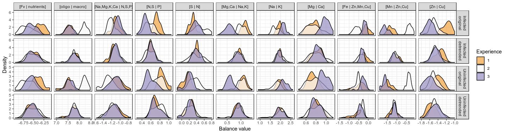

``` r
ggsave(filename = "images/Densité-Experience--detrended.png", width = 16,
       height = 4, dpi = 300)
```

The linear discriminant analysis across detrended balances.

``` r
group <- data$Experience
meta_group <- data$Trait
bal_detrend_df <- data.frame(bal_detrend)
names(bal_detrend_df) <- ilrDef
pca <- dudi.pca(bal_detrend_df, scannf = FALSE, scale = FALSE)
lda <- discrimin(pca, group, scannf = FALSE)
plotDA(discrimin = lda, fac = group, groupfac = NULL, scaling = 2, propLoadings = 0.8, 
       facname = "Experiment", groupfacname = "Group") + scale_fill_manual(values = unique(couleurs)) + 
  theme_bw()
```

    ## 
    ## Attaching package: 'ellipse'

    ## The following object is masked from 'package:graphics':
    ## 
    ##     pairs

    ## Scale for 'fill' is already present. Adding another scale for 'fill',
    ## which will replace the existing scale.

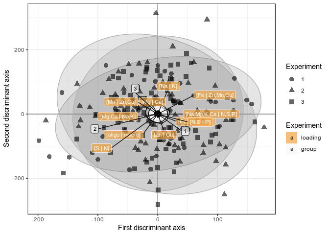

To end this section, I back-transform detrended ilrs to compositions.

``` r
comp_detrend <- ilrInv(bal_detrend, V = gsi.buildilrBase(t(sbp)))
```

Outliers
========

Outliers are removed in the ilr space, with a permissive criterion of `qcrit = 0.9995`. The `io` vector is `TRUE` for inliers and `FALSE` for outliers.

``` r
io <- sign2(bal_detrend, qcrit = 0.9995)$wfinal01 == 1
print(paste("number of outliers =", sum(!io)))
```

    ## [1] "number of outliers = 8"

``` r
print(paste("percentage of outliers =", 100 * sum(!io)/length(io), "%"))
```

    ## [1] "percentage of outliers = 3.33333333333333 %"

Explore data without outliers
-----------------------------

Densities of infected and uninfected cultivar ionomes.

``` r
cbind(group = group[io], 
      treatment=data$Trait[io], 
      bal_detrend[io, ]) %>%
  gather(variable, balance, -group, -treatment) %>% 
  ggplot(aes(x = balance)) + 
    facet_grid(treatment ~ variable, scales = "free") + 
    geom_density(aes(fill = group), alpha = 0.5) +
    theme_bw()
```

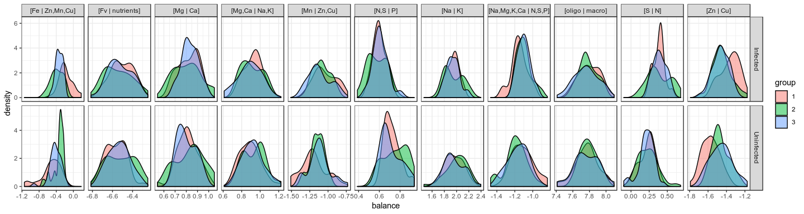

Linear discriminant analysis with cultivars as grouping factor, on detrended without outliers.

``` r
mmdf <- left_join(mmdf, susceptibility, by = "Cultivars")
mmdf_detrend <- left_join(mmdf_detrend, susceptibility, by = "Cultivars")

# LDA
group <- mmdf_detrend$Cultivars[io]
pca <- dudi.pca(bal_detrend[io, ], scannf = FALSE, scale = FALSE)
lda <- discrimin(pca, group, scannf = FALSE)
rownames(lda$fa) <- ilrDef
plotDA(discrimin = lda, fac = group, groupfac = NULL, scaling = 2, facname = "Cultivar", 
       groupfacname = "Group") + theme_bw()
```

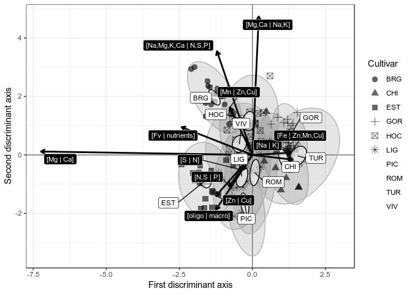

``` r
ggsave(filename = "images/LDA-detrend-tout.png", width = 8, height = 8, dpi = 300)
```

LDA on Uninfected only.

**Note**: The filling value balance is highly discriminant. Removing the filling value balance makes the LDA blobs not so alligned vertically.

``` r
group <- mmdf_detrend$Cultivars[data$Trait == "Uninfected" & io]
pca <- dudi.pca(bal_detrend[data$Trait == "Uninfected" & io, -1], scannf = FALSE, scale = FALSE)
lda <- discrimin(pca, group, scannf = FALSE)
rownames(lda$fa) <- ilrDef[-1]
lda_uninfected <- plotDA(discrimin = lda, fac = group, groupfac = NULL, scaling = 2, propLoadings = 0.4, 
       facname = "Susceptibility", groupfacname = "Group") + theme_bw()
lda_uninfected
```

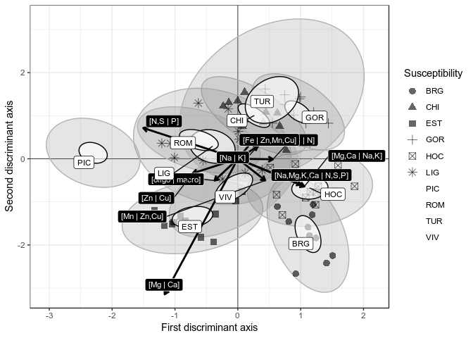

Densities of discriminant axes of uninfected

``` r
plot_ds1 <- data.frame(group, lda$li) %>% 
  ggplot(aes(x = DS1)) + 
    geom_density(aes(fill = group), alpha = 0.5) + 
    theme_bw()
plot_ds2 <- data.frame(group, lda$li) %>%
  ggplot(aes(x = DS2)) + 
    geom_density(aes(fill = group), alpha = 0.5) +
    theme_bw()
plot_grid(plot_ds1, plot_ds2, align='h', labels = c('A: uninfected', 'B: uninfected'))
```

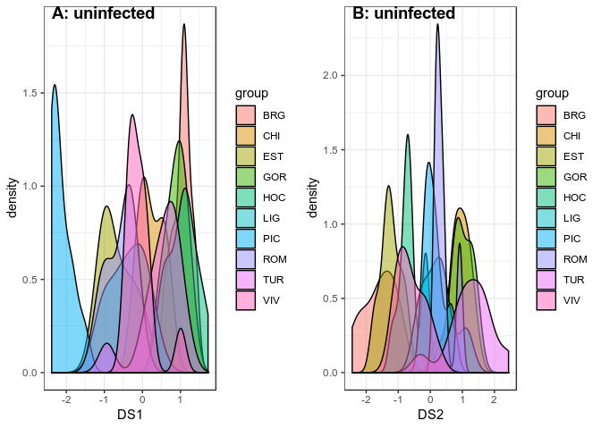

Idem, but on infected ionomes.

``` r
group <- mmdf_detrend$Cultivars[data$Trait == "Infected" & io]
pca <- dudi.pca(bal_detrend[data$Trait == "Infected" & io, -1], scannf = FALSE, scale = FALSE)
lda <- discrimin(pca, group, scannf = FALSE)
rownames(lda$fa) <- ilrDef[-1]
lda_infected <- plotDA(discrimin = lda, fac = group, groupfac = NULL, scaling = 2, propLoadings = 0.15, 
       facname = "Susceptibility", groupfacname = "Group") + theme_bw()
lda_infected
```

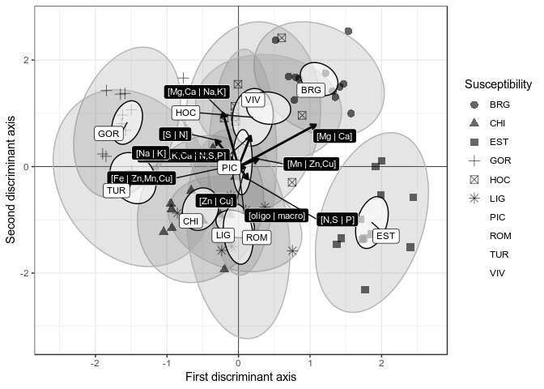

``` r
plot_ds1 <- data.frame(group, lda$li) %>% 
  ggplot(aes(x = DS1)) + 
    geom_density(aes(fill = group), alpha = 0.5) + 
    theme_bw()
plot_ds2 <- data.frame(group, lda$li) %>%
  ggplot(aes(x = DS2)) + 
    geom_density(aes(fill = group), alpha = 0.5) +
    theme_bw()
plot_grid(plot_ds1, plot_ds2, align='h', labels = c('A: infected', 'B: infected'))
```

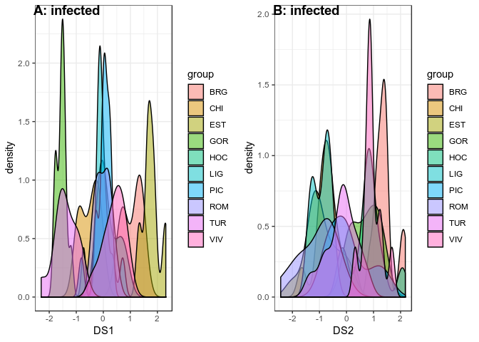

The discrimination between group performs surprisingly well when groups are segmented between inoculated and non-inoculated sets. We should make sure that we are not overfitting and overinterpreting things here. Let's see with a redundancy alanysis.

Plot both infected and uninfected linear discriminant analyses.

``` r
plot_grid(lda_uninfected, lda_uninfected, align="h", labels = c("A: Uninfected samples", "B: Infected samples"))
```


``` r
ggsave(filename = "images/LDA-inf-uninf.png", width = 12, height = 6, dpi = 300)
```

Redundancy analyses (RDA)
=========================

Redundancy analyses are performed to assess the *effect of the cultivar\*infection on the ionome*. I prepare two datasets: one with the balances where the experimental effect was removed (detrended), and the other one with original balances. The analysis where experimental effect was not removed is done with partial RDA, i.e. conditioned on the `Experience` column.

``` r
c_ <- mmdf_detrend$Cultivars[io]
c_ <- relevel(c_, ref = "VIV")
c_re <- mmdf$Cultivars[io]  # not detrended, ie with random effect (re): test partial RDA
c_re <- relevel(c_, ref = "VIV")
t <- data$Trait[io]
t <- factor(t, levels = rev(levels(t)))
levels(t)[2] <- "*"
bal_ <- bal_detrend[io, ]
redun_bal <- rda(bal_ ~ c_ * t, scale = TRUE)  #idem: redun_bal = rda(X=bal_, Y=model.matrix(~ c_ * trt_), scale=TRUE)
redun_bal_cond <- rda(bal_ ~ c_re * t + Condition(Experience), 
                      data = data.frame(c_re, t, Experience = mmdf$Experience[io]), scale = TRUE)
par(mfrow=c(1, 2))
ordiplot(redun_bal)
ordiplot(redun_bal_cond)
```


Ordination plots show very similar patterns. We keep on with detrended balances to assure consistency.

The `anova` function on RDA (in fact, the `anova.cca` function) uses permutations to test the signifiance of coefficients and axes of the RDA.

``` r
perm_test_term <- anova(redun_bal, by = "term")
perm_test_axis <- anova(redun_bal, by = "axis")
```

The ordination triplot is created with `ggplot2`.

``` r
triplot_scaling <- 2
wa_sc <- data.frame(scores(redun_bal, scaling = triplot_scaling, display = "wa"))
sp_sc <-  data.frame(scores(redun_bal, scaling = triplot_scaling, display = "species"), variable=ilrDef, type='sp')
bp_sc <- scores(redun_bal, scaling = triplot_scaling, display = "bp")
bp_sc <- data.frame(bp_sc, variable=rownames(bp_sc), type='bp')
sp_bp_sc <- rbind(sp_sc, bp_sc)
type_names <- list("sp" = "Response:\nionome", "bp" = "Explanatory:\ncultivars, treatment and their interaction")
type_labeller <- function(variable, value) return(type_names[value])


ggplot(wa_sc, aes(x=RDA1, y=RDA2)) +
  facet_grid(. ~ type, labeller=type_labeller) + 
  geom_vline(xintercept = 0, colour='grey15', lwd=0.3) +
  geom_hline(yintercept = 0, colour='grey15', lwd=0.3) +
  geom_point(alpha=0.05, size=1) +
  geom_segment(data=sp_bp_sc %>% filter(type=="sp"), aes(x=0, y=0, xend=RDA1, yend=RDA2), size=0.5,
               arrow=arrow(length=unit(0.2,"cm"))) +
  geom_label_repel(data = sp_bp_sc, mapping = aes(colour=type, fill=type, label=variable), segment.colour = "grey50") +
  geom_point(data = sp_bp_sc %>% filter(type=="bp"), size=2) +
  scale_fill_manual(values = c('black', 'white')) +
  scale_colour_manual(values = c('white', 'black')) +
  theme_bw() +
  theme(legend.position = 'none',
        strip.text.x = element_text(size = 12))
```

    ## Warning: The labeller API has been updated. Labellers taking `variable`and
    ## `value` arguments are now deprecated. See labellers documentation.


``` r
ggsave(filename = "images/RDA.png", width = 9, height = 4.5, dpi=300)
```

Compositional dendrograms
=========================

The following chunk explores patterns with compositional dendrograms. Plots are exported in the `images` subfolder.

``` r
RsquareAdj(redun_bal)$r.squared
```

    ## [1] 0.5137991

``` r
couleurs <- c("#3892e0", "#da4d45", "#f37329", "#fbd25d", "#93d844", "#8a4ebf", "#ffffff", 
              "#333333", "#66c2a5", "#fc8d62", "#8da0cb", "#e78ac3", "#a6d854", "#ffd92f", 
              "#e5c494", "#b3b3b3")

# Tout
png(filename = "images/codadendrogramme_tout_conf.png", units = "in", width = 10, 
    height = 8, res = 300)
CoDaDendrogram2(comp_detrend, V = gsi.buildilrBase(t(sbp)), equal.height = TRUE, 
                group = c_, type = "conf", conf.level = 0.95, range = "auto", col = couleurs)
legend(x = 11, y = 1.23, legend = levels(c_), pt.bg = couleurs, pch = 21)
dev.off()
```

    ## png 
    ##   2

``` r
png(filename = "images/codadendrogramme_tout_boxplot.png", units = "in", width = 10, 
    height = 8, res = 300)
CoDaDendrogram2(comp_detrend, V = gsi.buildilrBase(t(sbp)), equal.height = TRUE, 
                group = c_, type = "boxplot", range = "auto", col = couleurs)
legend(x = 11, y = 1.23, legend = levels(c_), pt.bg = couleurs, pch = 21)
dev.off()
```

    ## png 
    ##   2

``` r
# Non-Innoculé
png(filename = "images/codadendrogramme_uninfected_conf.png", units = "in", width = 10, 
    height = 8, res = 300)
CoDaDendrogram2(comp_detrend[data$Trait[io] == "Uninfected", ], V = gsi.buildilrBase(t(sbp)), 
                equal.height = TRUE, group = c_[data$Trait[io] == "Uninfected"], type = "conf", 
                conf.level = 0.95, range = "auto", col = couleurs)
legend(x = 11, y = 1.23, legend = levels(c_), pt.bg = couleurs, pch = 21)
dev.off()
```

    ## png 
    ##   2

``` r
png(filename = "images/codadendrogramme_uninfected_boxplot.png", units = "in", width = 10, 
    height = 8, res = 300)
CoDaDendrogram2(comp_detrend[data$Trait == "Uninfected", ], V = gsi.buildilrBase(t(sbp)), 
                equal.height = TRUE, group = c_[data$Trait == "Uninfected"], type = "boxplot", 
                range = "auto", col = couleurs)
legend(x = 11, y = 1.23, legend = levels(c_), pt.bg = couleurs, pch = 21)
dev.off()
```

    ## png 
    ##   2

``` r
# Innoculé
png(filename = "images/codadendrogramme_infected_conf.png", units = "in", width = 10, 
    height = 8, res = 300)
CoDaDendrogram2(comp_detrend[data$Trait[io] == "Infected", ], V = gsi.buildilrBase(t(sbp)), 
                equal.height = TRUE, group = c_[data$Trait[io] == "Infected"], type = "conf", 
                conf.level = 0.95, range = "auto", col = couleurs)
legend(x = 11, y = 1.23, legend = levels(c_), pt.bg = couleurs, pch = 21)
dev.off()
```

    ## png 
    ##   2

``` r
png(filename = "images/codadendrogramme_infected_boxplot.png", units = "in", width = 10, 
    height = 8, res = 300)
CoDaDendrogram2(comp_detrend[data$Trait[io] == "Infected", ], V = gsi.buildilrBase(t(sbp)), 
                equal.height = TRUE, group = c_[data$Trait[io] == "Infected"], type = "boxplot", 
                range = "auto", col = couleurs)
legend(x = 11, y = 1.23, legend = levels(c_), pt.bg = couleurs, pch = 21)
dev.off()
```

    ## png 
    ##   2

Analysis of the susceptibility to infection
===========================================

Question: can susceptibility class be discriminated by their ionome?

A linear discriminant analysis can portray a 2D representation of the most discriminant projection.

``` r
group <- mmdf_detrend$Niv..de.sens.
pca <- dudi.pca(unclass(bal_detrend), scannf = FALSE, scale = FALSE)
lda <- discrimin(pca, group, scannf = FALSE)
rownames(lda$fa) <- ilrDef
plotDA(discrimin = lda, fac = group, groupfac = NULL, scaling = 2, facname = "Susceptibility", 
       groupfacname = "Group") + scale_shape_manual(values = c(21, 22, 23, 24), "Susceptibility") + 
  theme_bw()
```

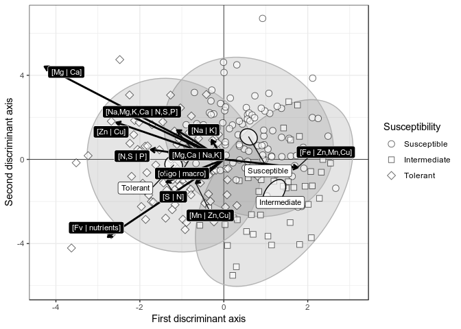

``` r
ggsave(filename = "images/LDA-detrended-tout-sensibilité.svg", width = 8, height = 8)
```

The general portrait doesn't consider the infection status.

We can conduct separated analyses for infected and uninfected samples.

First, the uninfected.

``` r
group <- mmdf_detrend$Niv..de.sens.[data$Trait == "Uninfected"]
pca <- dudi.pca(unclass(bal_detrend[data$Trait == "Uninfected", ]), scannf = FALSE, 
                scale = FALSE)
lda <- discrimin(pca, group, scannf = FALSE)
rownames(lda$fa) <- ilrDef
uninfected_LDA <- plotDA(discrimin = lda, fac = group, groupfac = NULL, scaling = 2, facname = "Susceptibility", 
       groupfacname = "Group", propLoadings = 0.5) + 
  scale_shape_manual(values = c(1, 2, 5), "Susceptibility") + 
  #xlim(c(-3, 2)) +
  ggtitle("A: Uninfected samples") +
  theme_bw() +
  theme(legend.position="none")
uninfected_LDA
```

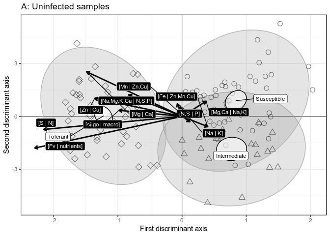

And the infected samples.

``` r
group <- mmdf_detrend$Niv..de.sens.[data$Trait == "Infected"]
pca <- dudi.pca(unclass(bal_detrend[data$Trait == "Infected", ]), scannf = FALSE, 
                scale = FALSE)
lda <- discrimin(pca, group, scannf = FALSE)
lda$li[, 1] <- -lda$li[, 1]
lda$fa[, 1] <- -lda$fa[, 1]
rownames(lda$fa) <- ilrDef
infected_LDA <- plotDA(discrimin = lda, fac = group, groupfac = NULL, scaling = 2, facname = "Susceptibility", 
       groupfacname = "Group", propLoadings = 0.5) + 
  scale_shape_manual(values = c(1, 2, 5), "Susceptibility") + 
  ggtitle("B: Infected samples") +
  #xlim(c(-4.2, 3)) +
  theme_bw() +
  theme(legend.position=c(0.4, 0.05), legend.direction="horizontal")
infected_LDA
```

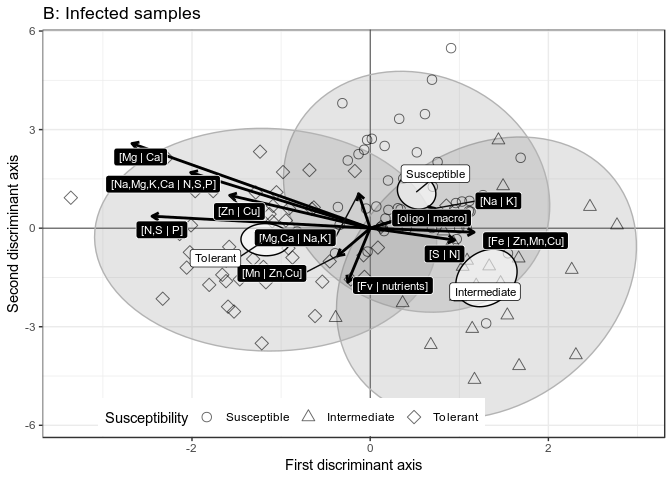

``` r
plot_grid(uninfected_LDA, infected_LDA)
```

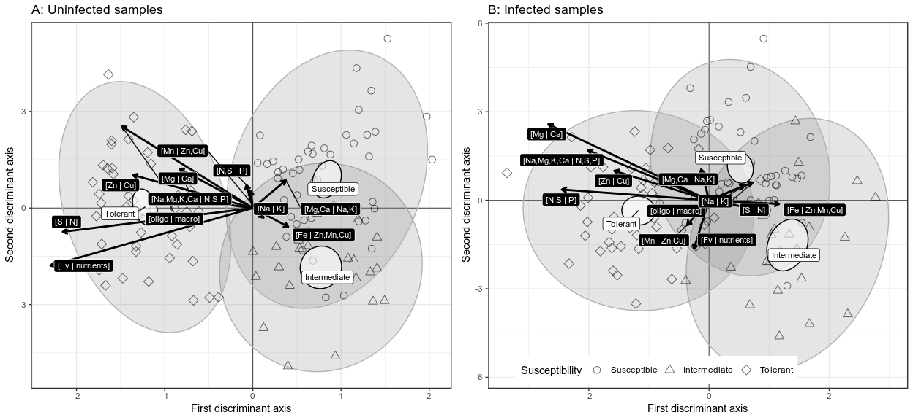

``` r
ggsave(filename = "images/lda_detrended_susceptibility.svg", width = 10, height = 5)
```

Compositional dendrograms
-------------------------

The following chunk exports compositional dendrograms for exploratory purposes.

``` r
col3 <- c(rgb(241/255, 163/255, 64/255), rgb(247/255, 247/255, 247/255), rgb(153/255, 
                                                                             142/255, 195/255))
col3_ <- c(rgb(191/255, 113/255, 14/255), rgb(185/255, 185/255, 185/255), rgb(94/255, 
                                                                              79/255, 149/255))
col3__ <- c(col3[1], col3_[1], col3[2], col3_[2], col3[3], col3_[3])

group <- as.character(mmdf_detrend$Niv..de.sens.[io])
is.infected <- ifelse(data$Trait == "Uninfected", "", "*")
group <- factor(paste(group, is.infected))

png(filename = "images/codadendrogramme_sensibilité_tout_conf.png", units = "in", 
    width = 10, height = 8, res = 300)
CoDaDendrogram2(comp_detrend[io, ], V = gsi.buildilrBase(t(sbp)), equal.height = TRUE, 
                group = group[io], type = "conf", conf.level = 0.95, range = "auto", col = col3__)
legend(x = 9, y = 1.2, legend = c("Susceptible uninfected", "Susceptible infected", 
                                  "Intermediate uninfected", "Intermediate infected", "Tolerant uninfected", "Tolerant infected"), 
       pt.bg = col3__, pch = 22)
dev.off()
```

    ## png 
    ##   2

``` r
png(filename = "images/codadendrogramme_sensibilité_tout_boxplot.png", units = "in", 
    width = 10, height = 8, res = 300)
CoDaDendrogram2(comp_detrend[io, ], V = gsi.buildilrBase(t(sbp)), equal.height = TRUE, 
                group = group[io], type = "boxplot", range = "auto", col = col3__)
legend(x = 10, y = 1.1, legend = c("Susceptible uninfected", "Susceptible infected", 
                                   "Intermediate uninfected", "Intermediate infected", "Tolerant uninfected", "Tolerant infected"), 
       pt.bg = col3__, pch = 22)
dev.off()
```

    ## png 
    ##   2

Mixed model
===========

In this last section, we are relating susceptibility index (DSI) with treatment (infection or not) and the ionome.

We prepare the `df_s` data.frame in this perspective.

``` r
df_s <- left_join(mmdf, susceptibility[, -3], by = "Cultivars")
df_s$sensib.num <- NA  # model.matrix(~df_s$Niv..de.sens.)[, 2]
df_s$sensib.num[df_s$Niv..de.sens. == "Tolerant"] <- 1
df_s$sensib.num[df_s$Niv..de.sens. == "Intermediate"] <- 0
df_s$sensib.num[df_s$Niv..de.sens. == "Susceptible"] <- -1
df_s$Trait <- factor(df_s$Trait, levels(df_s$Trait)[c(2, 1)])
colnames(df_s)[grepl("X.", colnames(df_s))] <- ilrNo
```

The `df_s_sc` table scales balances so that coefficients can be interpreted on the same scale.

``` r
df_s_sc <- df_s
df_s_sc[, 4:14] <- apply(df_s_sc[, 4:14], 2, function(x) base::scale(x))
```

We use the `nlme` package to linearly relate treatment and ionome (not detrended) to DSI, with `Experience` as random intercept.

``` r
mm_sensib_fixed_formula <- as.formula(paste("DSI ~ 1 +", paste("Trait *", ilrNo, collapse = "+")))
print(mm_sensib_fixed_formula)
```

    ## DSI ~ 1 + Trait * ilr1 + Trait * ilr2 + Trait * ilr3 + Trait * 
    ##     ilr4 + Trait * ilr5 + Trait * ilr6 + Trait * ilr7 + Trait * 
    ##     ilr8 + Trait * ilr9 + Trait * ilr10 + Trait * ilr11

``` r
mm_sensib_sc <- lme(df_s_sc, 
                 fixed = mm_sensib_fixed_formula,
                 random = ~1 | Experience)
```

The following table resumes the mixed model, with a signifiance test at the 0.05 level.

``` r
mms_summ <- summary(mm_sensib_sc)
mms_summ_LL <- intervals(mms_summ)[[1]][-1, 1]
mms_summ_val <- intervals(mms_summ)[[1]][-1, 2]
mms_summ_UL <- intervals(mms_summ)[[1]][-1, 3]

mms_intervals <- data.frame(ll = intervals(mms_summ)[[1]][-1, 1], 
                            est = intervals(mms_summ)[[1]][-1, 2], 
                            ul = intervals(mms_summ)[[1]][-1, 3], 
                            pval = mms_summ$tTable[-1, 5], 
                            is_significant = ifelse(mms_summ$tTable[-1, 5] <= 0.05, "significant at 0.05 level", "not significant at 0.05 level"))
mms_intervals$variable <- rownames(mms_intervals)
rownames(mms_intervals) <- 1:nrow(mms_intervals)

mms_intervals$variable[1] <- "Infected"
mms_intervals$variable[2:12] <- ilrDef
mms_intervals$variable[13:23] <- paste("Infected", ilrDef)
mms_intervals$variable <- factor(mms_intervals$variable, levels = rev(c("Infected", 
                                                                        ilrDef, paste("Infected", ilrDef))))
mms_intervals$variable_category <- factor(c("Treatment", rep("ILR", length(ilrDef)), 
                                            rep("Interactions", length(ilrDef))), levels = c("Treatment", "ILR", "Interactions"))
mms_intervals
```

    ##             ll         est         ul         pval
    ## 1   0.03525439  0.48034977  0.9254451 3.454507e-02
    ## 2  -1.75457121 -1.46274788 -1.1709246 3.318383e-19
    ## 3  -1.07851653 -0.61000701 -0.1414975 1.095823e-02
    ## 4  -0.37462420 -0.14617185  0.0822805 2.086148e-01
    ## 5  -0.43318754 -0.11861485  0.1959579 4.581515e-01
    ## 6  -1.25418633 -0.99494936 -0.7357124 1.132004e-12
    ## 7  -0.07841243  0.27805651  0.6345255 1.256417e-01
    ## 8  -0.01963142  0.19260043  0.4048323 7.506408e-02
    ## 9  -0.48673849 -0.13903218  0.2086741 4.314758e-01
    ## 10 -0.29447300 -0.03311403  0.2282449 8.030290e-01
    ## 11 -0.34808462  0.25927900  0.8666426 4.010337e-01
    ## 12 -0.89355024 -0.57013679 -0.2467233 6.187385e-04
    ## 13 -0.03991593  0.49819226  1.0363005 6.941065e-02
    ## 14  0.64308357  1.32430523  2.0055269 1.671494e-04
    ## 15 -0.69867978 -0.23888404  0.2209117 3.069543e-01
    ## 16 -0.91671601 -0.34697137  0.2227733 2.313127e-01
    ## 17  0.49019456  0.93913328  1.3880720 5.342490e-05
    ## 18 -0.25907055  0.25250687  0.7640843 3.316961e-01
    ## 19 -0.07481705  0.50077362  1.0763643 8.781113e-02
    ## 20 -0.58320861 -0.04677580  0.4896570 8.636969e-01
    ## 21  0.22594838  0.64157371  1.0571990 2.638264e-03
    ## 22 -1.75153900 -1.05929427 -0.3670495 2.868938e-03
    ## 23  0.06613418  0.49698270  0.9278312 2.397785e-02
    ##                   is_significant                      variable
    ## 1      significant at 0.05 level                      Infected
    ## 2      significant at 0.05 level              [Fv | nutrients]
    ## 3      significant at 0.05 level               [oligo | macro]
    ## 4  not significant at 0.05 level          [Na,Mg,K,Ca | N,S,P]
    ## 5  not significant at 0.05 level                     [N,S | P]
    ## 6      significant at 0.05 level                       [S | N]
    ## 7  not significant at 0.05 level                [Mg,Ca | Na,K]
    ## 8  not significant at 0.05 level                      [Na | K]
    ## 9  not significant at 0.05 level                     [Mg | Ca]
    ## 10 not significant at 0.05 level               [Fe | Zn,Mn,Cu]
    ## 11 not significant at 0.05 level                  [Mn | Zn,Cu]
    ## 12     significant at 0.05 level                     [Zn | Cu]
    ## 13 not significant at 0.05 level     Infected [Fv | nutrients]
    ## 14     significant at 0.05 level      Infected [oligo | macro]
    ## 15 not significant at 0.05 level Infected [Na,Mg,K,Ca | N,S,P]
    ## 16 not significant at 0.05 level            Infected [N,S | P]
    ## 17     significant at 0.05 level              Infected [S | N]
    ## 18 not significant at 0.05 level       Infected [Mg,Ca | Na,K]
    ## 19 not significant at 0.05 level             Infected [Na | K]
    ## 20 not significant at 0.05 level            Infected [Mg | Ca]
    ## 21     significant at 0.05 level      Infected [Fe | Zn,Mn,Cu]
    ## 22     significant at 0.05 level         Infected [Mn | Zn,Cu]
    ## 23     significant at 0.05 level            Infected [Zn | Cu]
    ##    variable_category
    ## 1          Treatment
    ## 2                ILR
    ## 3                ILR
    ## 4                ILR
    ## 5                ILR
    ## 6                ILR
    ## 7                ILR
    ## 8                ILR
    ## 9                ILR
    ## 10               ILR
    ## 11               ILR
    ## 12               ILR
    ## 13      Interactions
    ## 14      Interactions
    ## 15      Interactions
    ## 16      Interactions
    ## 17      Interactions
    ## 18      Interactions
    ## 19      Interactions
    ## 20      Interactions
    ## 21      Interactions
    ## 22      Interactions
    ## 23      Interactions

The table is shown in a plot.

``` r
ggplot(mms_intervals, aes(x = est, y = variable)) + 
  facet_grid(variable_category ~ ., scales = "free_y", space = "free_y") + 
  geom_segment(aes(x = ll, xend = ul, y = variable, yend = variable, colour = is_significant), size = 1) + 
  geom_point(aes(colour = is_significant)) + 
  geom_vline(xintercept = 0, colour = "grey50") + 
  scale_colour_manual(values = c("gray70", "gray30"), "Test") + 
  ylab("") + 
  xlab("Scaled effect") +
  theme_bw() + 
  theme(strip.text.y = element_text(angle = 0)) + 
  theme(legend.position = "bottom")
```

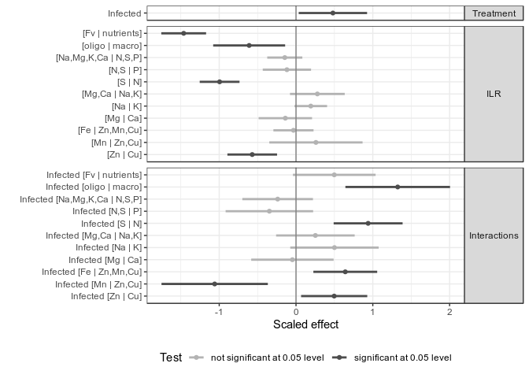

``` r
ggsave(filename = "images/mm_effet-bal-sur-DSI.png", width = 7, height = 5, dpi = 300)
```

For sake of exploratory analysis, we could ask the following question: how are balances affected by the infection? To answer the question, we create a linear mixed model for each ilr, with the treatment and the cultivar as fixed effect, and the experiment as random intercept.

Data need to be prepared correctly. The `VIV` cultivar is selected as reference.

``` r
df_s_sc$Cultivars <- relevel(df_s_sc$Cultivars, ref = "VIV")
```

We create several lists to store the results of each mixed model.

``` r
ilr_summ <- list()
ilr_aov <- list()
ilr_summ_val <- list()
ilr_summ_LL <- list()
ilr_summ_UL <- list()
ilr_summ_pval <- list()
```

In a loop over each ilr, we run a mixed model and store results in lists.

``` r
for (i in 1:length(ilrNo)) {
  mix_model <- lme(df_s_sc, fixed = as.formula(paste(ilrNo[i], "~ Trait * Cultivars")), 
                   random = ~1 | Experience)
  ilr_aov[[i]] <- anova(mix_model)
  ilr_summ[[i]] <- summary(mix_model)$tTable
  ilr_summ_val[[i]] <- ilr_summ[[i]][-1, 1]
  ilr_summ_LL[[i]] <- intervals(mix_model)[[1]][-1, 1]
  ilr_summ_UL[[i]] <- intervals(mix_model)[[1]][-1, 3]
  ilr_summ_pval[[i]] <- ilr_summ[[i]][-1, 5]
}
```

Results stored in lists are converted to data.frames.

``` r
names(ilr_summ) <- ilrDef
names(ilr_aov) <- ilrDef

ilr_df_val <- data.frame(ilr_summ_val)
colnames(ilr_df_val) <- ilrDef

ilr_df_LL <- data.frame(ilr_summ_LL)
colnames(ilr_df_LL) <- ilrDef

ilr_df_UL <- data.frame(ilr_summ_UL)
colnames(ilr_df_UL) <- ilrDef

ilr_df_pval <- data.frame(ilr_summ_pval)
colnames(ilr_df_pval) <- ilrDef
```

Names of effects are turned prettier.

``` r
effect_names <- c("Infected", 
                  paste("Cultivar", levels(df_s_sc$Cultivars)[-1]), 
                  paste("Infected Cultivar",levels(df_s_sc$Cultivars)[-1]))

effect_cultivar <- c("None", levels(df_s_sc$Cultivars)[-1], levels(df_s_sc$Cultivars)[-1])
```

And prettier tables...

``` r
### Val
ilr_df_val$Effect <- factor(effect_names)
ilr_df_val$EffectType <- factor(c("Treatment", rep("Cultivar", nlevels(df_s_sc$Cultivars) - 
                                                     1), rep("Interactions", nlevels(df_s_sc$Cultivars) - 1)))
ilr_df_val$Cultivars <- effect_cultivar
ilr_df_val <- left_join(ilr_df_val, susceptibility[, -3], by = "Cultivars")
```

    ## Warning: Column `Cultivars` joining character vector and factor, coercing
    ## into character vector

``` r
### Lower limit
ilr_df_LL$Effect <- ilr_df_val$Effect
ilr_df_LL$EffectType <- ilr_df_val$EffectType
ilr_df_LL$Cultivars <- ilr_df_val$Cultivars
ilr_df_LL <- left_join(ilr_df_LL, susceptibility[, -3], by = "Cultivars")
```

    ## Warning: Column `Cultivars` joining character vector and factor, coercing
    ## into character vector

``` r
### Upper limit
ilr_df_UL$Effect <- ilr_df_val$Effect
ilr_df_UL$EffectType <- ilr_df_val$EffectType
ilr_df_UL$Cultivars <- ilr_df_val$Cultivars
ilr_df_UL <- left_join(ilr_df_UL, susceptibility[, -3], by = "Cultivars")
```

    ## Warning: Column `Cultivars` joining character vector and factor, coercing
    ## into character vector

``` r
## arrange effect p-value table
ilr_df_pval$Effect <- ilr_df_val$Effect
ilr_df_pval$EffectType <- ilr_df_val$EffectType
ilr_df_pval$Cultivars <- ilr_df_val$Cultivars
ilr_df_pval <- left_join(ilr_df_pval, susceptibility[, -3], by = "Cultivars")
```

    ## Warning: Column `Cultivars` joining character vector and factor, coercing
    ## into character vector

All in one table...

``` r
val_gather <- gather(ilr_df_val, variable, balance, -Effect, -EffectType, -Cultivars, -Niv..de.sens.)
ll_gather <- gather(ilr_df_LL, variable, ll, -Effect, -EffectType, -Cultivars, -Niv..de.sens.)
ul_gather <- gather(ilr_df_UL, variable, ul, -Effect, -EffectType, -Cultivars, -Niv..de.sens.)
pval_gather <- gather(ilr_df_pval, variable, pval, -Effect, -EffectType, -Cultivars, -Niv..de.sens.)

gg_effect <- data.frame(val_gather, 
                        ll = ll_gather$ll, 
                        ul = ul_gather$ul, 
                        p.value = pval_gather$pval)
gg_effect$is.significant <- gg_effect$p.value <= 0.05
gg_effect$EffectType <- factor(gg_effect$EffectType, levels(gg_effect$EffectType)[c(3, 1, 2)])
gg_effect$is.significant <- factor(gg_effect$is.significant)
levels(gg_effect$is.significant) <- c("not significant at 0.05 level", "significant at 0.05 level")
names(gg_effect)[4] <- "Susceptibility"
gg_effect$Susceptibility <- as.character(gg_effect$Susceptibility)
gg_effect$Susceptibility[is.na(gg_effect$Susceptibility)] <- "n/a"
gg_effect$Susceptibility <- factor(gg_effect$Susceptibility, levels = unique(gg_effect$Susceptibility)[c(3, 4, 2, 1)])
```

Reordering balances.

``` r
gg_effect$variable <- factor(gg_effect$variable, levels=ilrDef)
```

Reordering cultivars by susceptibility.

``` r
order_susceptibility <- c("Infected", 
                          "Cultivar CHI", "Cultivar GOR", "Cultivar PIC",
                          "Cultivar ROM", "Cultivar TUR", "Cultivar BRG",
                          "Cultivar EST", "Cultivar HOC", "Cultivar LIG",
                          "Infected Cultivar CHI", "Infected Cultivar GOR", "Infected Cultivar PIC",
                          "Infected Cultivar ROM", "Infected Cultivar TUR", "Infected Cultivar BRG", 
                          "Infected Cultivar EST", "Infected Cultivar HOC", "Infected Cultivar LIG")
gg_effect$Effect <- factor(gg_effect$Effect, levels = order_susceptibility)
```

And the plot...

``` r
ggplot(gg_effect) +
  facet_grid(EffectType ~ variable, scales = "free_y", space = "free_y") + 
  geom_segment(aes(x = Effect, xend = Effect, y = ll, yend = ul, colour = is.significant), size = 1) + 
  geom_point(aes(y = balance, x = Effect, fill = is.significant, shape = Susceptibility), size = 2) + 
  geom_hline(yintercept = 0, colour = "grey50") + 
  ylab("Scaled effect") + 
  coord_flip() + 
  theme_bw() + 
  scale_fill_manual(values = c("gray70", "gray30"), "Test") +
  scale_colour_manual(values = c("gray70", "gray30"), "Test") + 
  scale_shape_manual(values = c(21, 22, 23, 24), "Susceptibility") + 
  theme(strip.text.y = element_text(angle = 0))
```

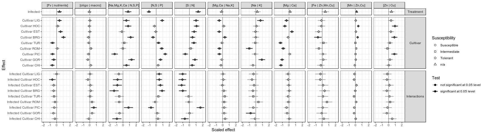

``` r
ggsave(filename = "images/mm_effet-sur-les-balances.png", width = 18, height = 5, dpi = 300)
```

The `Treatment` row in the plot shows the effect of infection alone on individual balances. The second group, `Cultivar`, shows the effect of the cultivar alone ion individual balances. The third group, `Interactions`, shows how each cultivar reacts diffently with infection from `VIV` infected samples.
